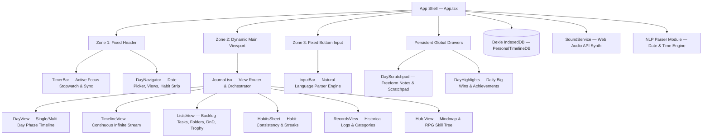
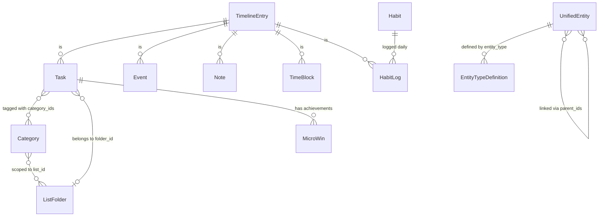

# FlowDay — Architecture & Component Reference Guide

> **Purpose:** This document provides a complete overview of the application architecture, component hierarchy, directory structures, domain models, data flow, and file roles for future development and reference.

---

## 1. High-Level Architecture Overview

FlowDay is an offline-first personal productivity and timeline management system designed for ultra-low latency, keyboard accessibility, and intuitive task/event orchestration. It combines a chronological daily timeline, backlog task organization, structured habit tracking, multi-tier RPG skill trees, and mindmap entity graphs.



---

## 2. Directory Structure & File Map

```text
flow-day/
├── src/
│   ├── App.tsx                          # Root application container and view layout coordinator
│   ├── main.tsx                         # React 19 entry point and DOM root mounter
│   ├── index.css                        # Tailwind CSS imports, global themes, scrollbar styling
│   ├── db.ts                            # Dexie.js schema, table definitions, and migrations (v1 - v15)
│   ├── types.ts                         # Core TypeScript data models, interfaces, and union types
│   ├── utils.ts                         # Pure date manipulation, formatting, and duration math helpers
│   │
│   ├── services/                        # Global non-UI services & application utilities
│   │   ├── audio.ts                     # Web Audio API sound generator (complete, strike, tick SFX)
│   │   └── storage.ts                   # Type-safe localStorage wrapper with fallback handling
│   │
│   ├── lib/                             # Pure business logic and algorithms
│   │   ├── confetti.ts                  # Zero-dependency HTML5 canvas celebration confetti engine
│   │   ├── habitUtils.ts                # "Never Miss Twice" streak algorithms, scheduling, and themes
│   │   └── parser/                      # Natural language date & time NLP parsing
│   │       ├── dateParser.ts            # Smart relative date parser ("tomorrow", "next monday")
│   │       ├── timeSpanParser.ts        # Start/end time extraction and single time token parsing
│   │       └── index.ts                 # Unified parser exports
│   │
│   ├── hooks/                           # Custom React hooks
│   │   └── useGistSync.ts               # Encrypted GitHub Gist backup, cloud sync, and conflict resolver
│   │
│   └── components/                      # UI Presentation & View Layer
│       ├── AnimatedFireIcon.tsx         # Animated streak flame icon for habit streaks
│       ├── CategoryIcon.tsx             # Dynamic Lucide icon loader with unified color dot/ring badges
│       ├── CategoryManagementSheet.tsx  # CRUD drawer for organizing category tags
│       ├── CategoryStrip.tsx            # Horizontal scrollable category pill selector
│       ├── DayNavigator.tsx             # Date navigation, mini-calendar, view mode selector & habit strip
│       ├── DetailSheet.tsx              # Universal slide-over drawer for viewing & editing entries
│       ├── DomainPickerSheet.tsx        # Relationship linker for Domains
│       ├── EntryContextMenu.tsx         # Universal right-click / long-press contextual action menu
│       ├── FocusSheet.tsx               # Dedicated focus timer mode and pomodoro stats
│       ├── GoalPickerSheet.tsx          # Relationship linker for Goals
│       ├── GoalsSheet.tsx               # Goal management panel with milestone tracking
│       ├── HabitConsistencyModal.tsx    # Monthly consistency heatmap modal for habits
│       ├── HabitsSheet.tsx              # Legacy popup modal for habits
│       ├── IconPickerModal.tsx          # Visual searchable Lucide icon grid picker
│       ├── InlineIconColorPopover.tsx   # Fast inline icon and color customizer popover
│       ├── InputBar.tsx                 # Fixed bottom quick-capture input with live NLP chips
│       ├── MarkdownPreview.tsx          # Lightweight Markdown renderer for notes and tasks
│       ├── ObjectivePickerSheet.tsx     # Relationship linker for Objectives
│       ├── ObjectivesSheet.tsx          # Objective management panel
│       ├── PurposePickerSheet.tsx       # Relationship linker for Purposes
│       ├── Settings.tsx                 # Global settings drawer (sync, sleep time, card layout, export/import)
│       ├── SortableRow.tsx              # Drag-and-Drop row wrapper powered by @dnd-kit
│       ├── TaskListManagerModal.tsx     # Custom task lists creation and palette manager
│       ├── TimePickerSheet.tsx          # Mobile scrollable wheel time picker
│       ├── TimerBar.tsx                 # Top sticky focus timer bar, active task selector, and sync status
│       │
│       └── journal/                     # Core Journal Views & Subsystems
│           ├── Journal.tsx              # Master view switcher, entry detail coordination, and data query
│           ├── DayView.tsx              # Multi-day grid & single-day timeline switcher (1D, 3D, 4D, 1W)
│           ├── DayTimeline.tsx          # Chronological day phase sections (Morning, Noon, Afternoon, Night)
│           ├── TimelineView.tsx         # Continuous multi-day chronological stream
│           ├── RecordsView.tsx          # Historical log list grouped by custom record categories
│           ├── ListsView.tsx            # Backlog & tasks management workspace
│           ├── TimeRulerOverlay.tsx     # Interactive visual time-ruler overlay for tactile drag-to-schedule
│           ├── DayScratchpad.tsx        # Persistent slide-over scratchpad with task-conversion
│           ├── DayHighlights.tsx        # Starred accomplishment and win showcase
│           ├── RecordCategoryManagerModal.tsx # Category tag manager for Record entries
│           ├── RecordCategoryPickerModal.tsx  # Category tag picker for Record entries
│           │
│           ├── habits/                  # Redesigned Habits & Routines Dashboard
│           │   ├── HabitsView.tsx               # Master Habits view with multi-view switcher & 100% width
│           │   ├── HabitMatrixGrid.tsx          # Full-width punch-card matrix grid with frozen column
│           │   ├── HabitRoutineCardsView.tsx    # Circadian routine stacks (Morning, Afternoon, Evening)
│           │   ├── HabitItemCard.tsx            # Habit card with steppers, streaks & sparklines
│           │   ├── HabitAnalyticsView.tsx       # 12-week activity heatmaps & streak leaderboard
│           │   └── HabitFormModal.tsx           # Comprehensive habit & routine create/edit modal
│           │
│           ├── lists/                   # Modular Subcomponents for Backlog & ListsView
│           │   ├── DesktopTaskCard.tsx          # Desktop task card with actions, badges, and status
│           │   ├── MobileTaskItem.tsx           # Mobile swipeable task row with gesture action tray
│           │   ├── FolderCard.tsx               # Collapsible and droppable folder group
│           │   ├── TrophyView.tsx               # Accomplishments wall grouped chronologically by month/year
│           │   ├── PaperListView.tsx            # Minimalist printable paper checklist view
│           │   ├── ScheduleCalendarModal.tsx    # Quick scheduling calendar popover
│           │   ├── MoveToFolderModal.tsx        # Folder assignment modal
│           │   ├── TaskStatusPickerPopover.tsx  # 5-status selection popover (Todo, Active, Done, Dropped, Maybe)
│           │   └── ListPickerPopover.tsx        # Multi-list tag assignment popover
│           │
│           └── hub/                     # Hub: Dynamic Graph, Mindmap & RPG Skill Tree
│               ├── GenericEntitySheet.tsx       # Universal dynamic entity editor
│               │
│               ├── mindmap/                     # Infinite Canvas Mindmap (Powered by @xyflow/react)
│               │   ├── MindmapCanvas.tsx        # Interactive canvas with zoom, pan, auto-layout & dragging
│               │   ├── types.ts                 # Mindmap node, edge, and viewport state interfaces
│               │   ├── components/
│               │   │   ├── MindmapNodes.tsx     # Custom rendered Mindmap nodes with tier styling
│               │   │   ├── MindmapEdge.tsx      # Custom smooth/step/straight connecting edges
│               │   │   ├── MindmapHeader.tsx    # Top bar for Mindmap controls & search
│               │   │   ├── MindmapControls.tsx  # Zoom in, zoom out, fit view, layout buttons
│               │   │   ├── MindmapContextMenu.tsx# Node right-click context menu
│               │   │   ├── MindmapCreateModal.tsx# Fast node creation modal
│               │   │   ├── MindmapEdgeModal.tsx  # Edge relationship metadata editor
│               │   │   ├── MindmapInspector.tsx # Side property inspector for selected node
│               │   │   └── MindmapSpawnerDock.tsx# Bottom docking bar to spawn new entities
│               │   ├── hooks/
│               │   │   ├── useMindmapKeyboard.ts# Keyboard shortcuts (Tab=Child, Enter=Sibling, Del=Remove)
│               │   │   └── useMindmapStorage.ts # Persistent canvas node coordinates & viewport storage
│               │   └── utils/
│               │       ├── geometry.ts          # Node bounds and connection angle mathematics
│               │       └── treeHierarchy.ts     # Dagre automatic hierarchical tree layout algorithm
│               │
│               └── skilltree/                   # RPG Skill Tree & Orbit Solar System Subsystem
│                   ├── SkillTreeCanvas.tsx      # Main skill tree canvas with tier columns & leveling
│                   ├── SkillGlobeCanvas.tsx     # Keplerian planetary orbit canvas (Solar system view)
│                   ├── SkillGlyph.tsx           # Elemental SVG rune and node glyph renderer
│                   ├── SkillLaserConduits.tsx   # Animated glowing energy laser connectors
│                   ├── SkillSortableTier.tsx    # Drag-and-drop tier reordering container
│                   ├── SkillTomeDrawer.tsx      # Grimoire slide-over drawer with mastery drills & XP
│                   ├── types.ts                 # Skill ranks, elemental themes, and stat formulas
│                   └── utils.ts                 # Level XP curve & mastery math calculations
```

---

## 3. Data Model & Database Architecture (`src/db.ts`)

FlowDay uses **Dexie.js (IndexedDB)** with 15 incremental schema migrations:



### Key Entities:
1. **`entries` (`TimelineEntry`)**: Polymorphic table storing tasks, events, notes, time-blocks, and habit logs. Indexed by `scheduled_at`, `timestamp`, `status`, `*category_ids`, and `sort_order`.
2. **`habits` (`Habit`)**: Master habit definitions with recurring metadata and color schemes.
3. **`categories` (`Category`)**: Categorization system scoped by `task-list`, `record-category`, `goal`, or `objective`.
4. **`list_folders` (`ListFolder`)**: Sub-groupings inside custom task lists.
5. **`entities` (`UnifiedEntity`)**: Dynamic node graph storing Purposes, Domains, Goals, Objectives, Skills, and custom user-defined entity types with arbitrary multi-parent relationships (`parent_ids`).
6. **`entity_types` (`EntityTypeDefinition`)**: Configuration table defining schema rules (e.g. status support, time tracking support) for unified entities.

---

## 4. Key Subsystems & Core Logic

### A. Natural Language Processing Engine (`src/lib/parser/`)
The input bar features a zero-dependency regex-based NLP parser:
* **Date Parsing (`dateParser.ts`)**: Recognizes relative keywords (`today`, `tomorrow`, `in 3 days`) and explicit date formats (`15/10/2026`, `5/8`).
* **Time Span Parsing (`timeSpanParser.ts`)**: Recognizes start/end spans (`from 2pm to 4pm`, `from now to 3:30pm`), point-in-time (`at 4:30pm`, `at 14:00`), and durations (`now 45m`, `2h`, `1h30m`).

### B. Centralized Sound Service (`src/services/audio.ts`)
Synthesizes procedural sound effects using the Web Audio API without requiring any external MP3/WAV assets:
* `playCompleteSound()`: Crisp triangle harmonic ramp for task and habit completions.
* `playStrikeSound()`: Textured pencil scrape sound synthesized with filtered noise and periodic oscillations.
* `playClickSound()`: Subtle tactile feedback tick.

### C. Lists & Backlog Architecture (`src/components/journal/lists/`)
`ListsView` is divided into single-responsibility subcomponents:
* **`DesktopTaskCard` & `MobileTaskItem`**: Optimized cards and rows featuring touch swipe trays, quick scheduling, list assignment, and status pickers.
* **`FolderCard`**: Drag-and-drop droppable folder container using `@dnd-kit`.
* **`TrophyView`**: Accomplishments wall aggregating completed items by month and year.
* **`PaperListView`**: High-contrast printable backlog view.

### D. Hub, Mindmap & SkillTree (`src/components/journal/hub/`)
* **Mindmap (`hub/mindmap/`)**: Infinite graph canvas built on `@xyflow/react` with Dagre tree layout, keyboard navigation, and custom node/edge metadata.
* **Skill Tree (`hub/skilltree/`)**: RPG-style gamified progression system with Keplerian celestial orbital revolution (`SkillGlobeCanvas`), laser conduits, XP curves, and skill grimoire drawers.

---

## 5. Development Guidelines & Best Practices

1. **Keep UI Components Modular**: Subcomponents exceeding 300-400 lines should be broken down into dedicated feature files.
2. **Use the Parser Library**: When adding or testing input syntax, update `src/lib/parser/` and write pure function unit tests.
3. **Use Shared Services**: Always invoke audio feedback through `playCompleteSound()` / `playStrikeSound()` in `src/services/audio.ts` rather than instantiating new `AudioContext` instances.
4. **Type Strictness**: Use `ViewMode`, `DayRange`, and `TimelineEntry` from `src/types.ts` to ensure end-to-end type safety across headers, drawers, and views.
