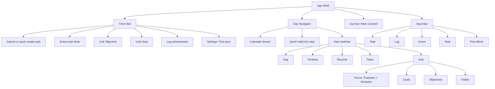

# Flow Day UX/UI Flow

This document maps the current app experience and highlights what to improve or add next.

## Product Shape

Flow Day is an offline-first personal productivity workspace built around three daily loops:

1. Capture what matters quickly.
2. Work from tasks with a live timer.
3. Review the day, records, goals, objectives, habits, and focus areas.

The UI is organized into three persistent zones:

| Zone | Location | Purpose |
| --- | --- | --- |
| Timer Bar | Fixed top | Search/create an active task, run timer, link objective/goal, sync cloud data, open settings. |
| Navigator + Content | Top controls + scrollable main area | Switch dates and modes: Day, Timeline, Records, Tasks, Hub. |
| Input Bar | Fixed bottom, hidden in Hub | Quick-create tasks, logs, events, notes, and time blocks with smart date/time parsing. |

## Information Architecture

## Primary User Journeys

### 1. Daily Capture

Entry point: bottom input bar.

1. User selects an input type: Task, Log, Event, Note, or Time Block.
2. User types natural language with optional date/time text.
3. App parses dates like today, tomorrow, in 3 days, or 24/6.
4. App parses times like at 3pm or from 2pm to 4pm.
5. Entry is saved into the timeline and appears in Day, Timeline, Records, or Tasks depending on type.

Current strength: fast capture without navigating away.

Current friction:

- The input bar has many modes and hints, but there is no first-run onboarding for what each mode means.
- Event and Note have both quick entry and detailed modal paths, which can feel inconsistent.
- Logs exist in code and UI, but are less visible in the product narrative than tasks/events/notes/time blocks.

### 2. Start Working

Entry point: top timer bar.

1. User searches existing unfinished tasks.
2. If no task exists, user types a title and creates one directly.
3. Timer starts automatically.
4. User can pause, resume, stop, finish, reset, or delete.
5. User can link the task to an Objective and optionally link that Objective to a Goal.
6. User can log achievements during the work session.

Current strength: the timer is always available and strongly connected to task progress.

Current friction:

- The timer, task search, objective link, goal link, achievements, sync, and settings all compete in the same top area.
- Linking a goal depends on first linking an objective, which is logical but may need clearer hierarchy.
- Achievements are powerful, but they are only visible after opening task details or while the task is active.

### 3. Review the Day

Entry point: Day mode.

1. User selects a date using previous/next, Today, or calendar drawer.
2. User sees tasks, events, notes, time blocks, logs, and habit logs for that day.
3. User can open detail sheets, edit timestamps, complete tasks, activate a task, carry tasks, or delete entries.
4. Overdue tasks can be imported or rescheduled.

Current strength: strong daily command center.

Current friction:

- Day view is doing both planning and history review. It may benefit from clearer "planned" vs "recorded" sections.
- Overdue task handling is useful but should be more visible as a dedicated daily planning prompt.

### 4. Browse History

Entry points: Timeline and Records.

Timeline:

1. User scrolls through day groups.
2. User can collapse days and jump dates.
3. User can edit or act on entries inline.

Records:

1. User browses event and note catalog.
2. User can search and filter by type.
3. User opens detail sheets for editing.

Current strength: separates chronological memory from searchable records.

Current friction:

- Records appears focused on events and notes, while tasks and time blocks live elsewhere. That distinction should be clearer.
- There is no analytics/review view for time spent, habits, goals, or objective progress over time.

### 5. Manage Tasks

Entry point: Tasks mode.

1. User views all active tasks.
2. User can reorder tasks, complete tasks, activate timer, open details, carry/reschedule, or delete.
3. User can jump the active date from task context.

Current strength: separates "all unfinished work" from day-specific planning.

Current friction:

- Tasks mode and Day mode overlap. The app needs a clearer rule: Day is "what belongs today", Tasks is "the full backlog".
- Task priority, due state, objective grouping, and filters would make this screen more decision-oriented.

### 6. Plan From Hub

Entry point: Hub mode.

Desktop: four-column layout.
Mobile: tabbed single-column layout.

Hub areas:

| Area | Purpose |
| --- | --- |
| Focus | Manage Purposes and Domains, then filter related Goals/Objectives/Habits. |
| Goals | Manage long-term outcomes/projects. |
| Objectives | Manage measurable sub-goals linked to goals. |
| Habits | Manage recurring behaviors and consistency. |

Current strength: good strategic layer above daily execution.

Current friction:

- "Hub", "Focus", "Purpose", "Domain", "Goal", and "Objective" are conceptually rich. Users need clearer mental models.
- Focus filters affect adjacent columns, but the relationship could be more explicit visually.
- Hub hides the bottom input bar, which is sensible, but creating work from a goal/objective may need its own path.

### 7. Habit Tracking

Entry points: quick habit strip and Hub/Habits.

1. User creates active habits in Hub.
2. Active habits appear as quick-tick chips in the navigator.
3. Tapping a habit creates or removes a habit log for the active date.
4. User can inspect consistency in the habit modal.

Current strength: extremely fast daily habit logging.

Current friction:

- Quick ticks are tied to the active date, but the log timestamp uses the current time. For past/future dates, this may confuse users.
- Habit logs appear in the timeline, but the main habit insight is separate in a modal.

### 8. Sync and Settings

Entry points: settings button and quick sync buttons.

1. User opens Settings.
2. User enters GitHub PAT and Gist ID or auto-creates a Gist.
3. User saves credentials, tests connection, pushes local data, or pulls cloud data.
4. When configured, quick push/pull buttons appear in the timer bar.

Current strength: offline-first with explicit backup and restore.

Current friction:

- GitHub PAT setup is technical for non-developers.
- Pull overwrites local data, so conflict handling and backup previews would reduce risk.

## Screen Map

| Screen / State | Main User Intent | Important Actions |
| --- | --- | --- |
| Idle Timer Bar | Find or create current task | Search, create, start, open settings, push/pull sync |
| Active Timer Bar | Track focused work | Pause, resume, stop, finish, reset, delete, link objective/goal, log achievement |
| Day View | Work and review one day | Complete task, activate task, reschedule/carry, edit, delete, import overdue |
| Timeline View | Browse chronological history | Collapse day, inspect/edit entries, activate tasks |
| Records View | Find notes/events | Search, filter, edit, delete |
| Tasks View | Manage active backlog | Sort, complete, activate, carry, edit, delete |
| Hub / Focus | Define life areas and purpose filters | Create/edit/delete/sort purposes and domains, assign domains |
| Hub / Goals | Manage long-term outcomes | Create, edit, archive/achieve, categorize, purpose-link |
| Hub / Objectives | Manage measurable work streams | Create, edit, complete/archive, link to goal, categorize, purpose-link |
| Hub / Habits | Manage routines | Create, tick, archive, inspect consistency, purpose-link |
| Detail Sheet | Edit a single item | Edit title/content/time/spent/achievements |
| Settings Modal | Configure sync | Save PAT/Gist ID, test, auto-create, push, pull |

## Recommended Improvements

### High Priority

1. Add an onboarding or empty-state path.
   Explain the core loop in-product: Capture -> Plan Today -> Focus Timer -> Review -> Improve.

2. Clarify the main navigation language.
   Consider renaming or adding subtitles:
   - Day: Today Plan
   - Timeline: History
   - Records: Notes & Events
   - Tasks: Backlog
   - Hub: Strategy

3. Add a daily planning panel.
   At the top of Day view, show overdue tasks, today's scheduled tasks, active habits, and suggested next focus.

4. Improve task organization.
   Add priority, due date, objective filter, goal filter, and "no objective" grouping in Tasks mode.

5. Make Goal -> Objective -> Task creation smoother.
   From a Goal, allow "Add Objective".
   From an Objective, allow "Add Task".
   From a Purpose/Domain filter, allow creating linked Goals/Objectives/Habits.

6. Add visual progress summaries.
   Show time spent this day/week, completed tasks, habit completion, active objective progress, and goal rollups.

### Medium Priority

1. Add conflict-safe sync.
   Before Pull, show cloud timestamp and local timestamp. Consider "download backup before overwrite".

2. Create a Weekly Review view.
   Summarize completed tasks, time spent by goal/objective, habit consistency, notes/events, and unfinished carry-over.

3. Strengthen Records.
   Add tags, date range filters, type filters for logs/time blocks, and saved searches.

4. Improve habit date behavior.
   When activeDate is not today, create habit logs at a sensible time on that date or clearly label the logged timestamp.

5. Surface achievements.
   Add an Achievements view or show them in weekly review and task details more prominently.

6. Add quick actions to calendar days.
   Long-press or context menu: plan day, add task, review day, carry overdue here.

### Lower Priority / Nice to Have

1. Command palette for power users.
2. Keyboard shortcuts for view switching and timer control.
3. Templates for recurring planning routines.
4. Goal/objective progress charts.
5. Export to Markdown/CSV.
6. Gentle reminders or notifications for active timer, habits, and overdue tasks.
7. Theme settings for contrast and accent color.

## Suggested North-Star UX

The app should make the user feel like each day has a clear path:

1. "What matters today?"
2. "What am I working on now?"
3. "What did I complete or learn?"
4. "How does this connect to my bigger goals?"

To support that, the next big UX move should be turning Day view into a stronger daily command center, while Hub becomes the strategic planning center and Tasks becomes the backlog control center.

## Potential Next Features

| Feature | Why It Helps |
| --- | --- |
| Daily Plan section | Makes the start-of-day workflow obvious. |
| Weekly Review | Turns captured data into insight. |
| Goal/Objective task creation | Connects strategy to execution. |
| Priority and filters in Tasks | Makes backlog decisions faster. |
| Progress dashboard | Gives users feedback and motivation. |
| Conflict-aware sync | Reduces data-loss anxiety. |
| First-run sample data | Lets new users understand the app quickly. |

## UX Risks To Watch

1. Too many planning concepts without explanation.
   Purpose, Domain, Goal, Objective, Task, Habit, Log, Event, Note, and Time Block are useful but need progressive disclosure.

2. Too much power in fixed bars.
   The timer and input bars are efficient, but they can visually crowd mobile users.

3. Hidden relationships.
   Time rolls up from tasks to objectives to goals, but users may not notice unless progress views make it visible.

4. Data overwrite risk.
   Pull-from-cloud is powerful and should continue using strong confirmation, ideally with preview/backup.

5. Records fragmentation.
   Users may wonder why some history is in Records while tasks and time blocks are not.

